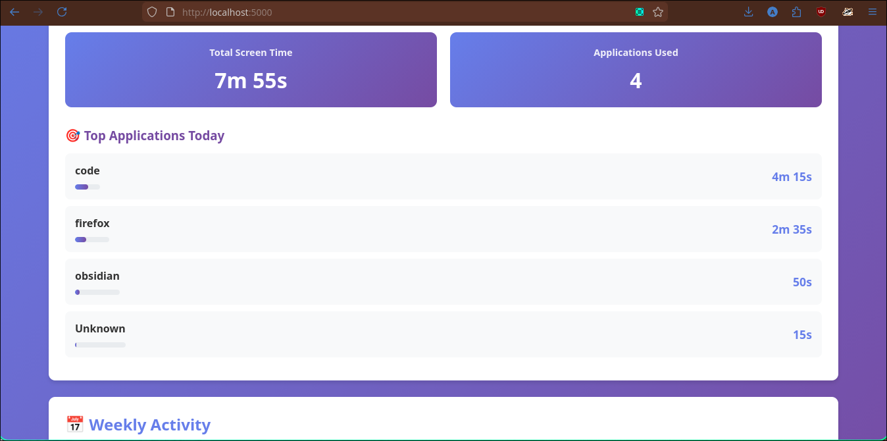
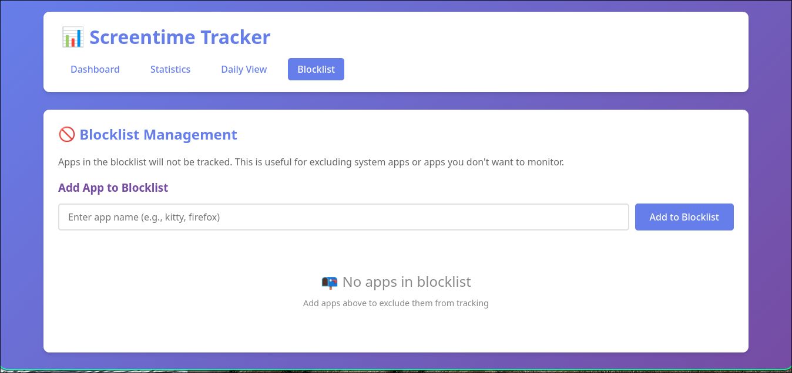

# Screentime - CLI Screen Time Tracker for Arch Linux

A lightweight CLI application to track and analyze your screen time on Arch Linux. Supports both X11 and Wayland display servers.

## Features

- 🌐 **Web GUI interface** with interactive dashboard
- 📊 Track active window and application usage
- 🕐 View daily, weekly, and custom date range statistics
- 🎯 Support for both X11 and Wayland
- 💾 Local SQLite database storage
- 🔄 Background daemon mode
- 📈 Visual statistics with progress bars
- 📱 Responsive web design for mobile and desktop

## Screenshots
### Dashboard

### Blocklist

## Installation

### Prerequisites

### Install Python dependencies

```bash
pip install -r requirements.txt
```

### Make executable

```bash
chmod +x screentime.py
```

### Optional: Create symlink for system-wide access

```bash
sudo ln -s $(pwd)/screentime.py /usr/local/bin/screentime
```

## Usage

### Web Interface

A modern web-based GUI is available for visualizing your screen time data:

**Start the web interface:**
```bash
python3 app.py
```

Then open your browser and navigate to:
```
http://localhost:5000
```

The web interface provides:
- 📈 Interactive dashboard with today's overview
- 📊 Detailed statistics with customizable time ranges
- 📅 Daily breakdown view with date picker
- 🎨 Beautiful gradient UI with progress bars
- 📱 Responsive design for mobile devices

You can run both the tracker daemon and web interface simultaneously:
```bash
# Terminal 1: Start tracking
./screentime.py start --daemon

# Terminal 2: Start web interface
python3 app.py
```

### CLI Usage

#### Start Tracking

**Foreground mode (see live logs):**
```bash
./screentime.py start
```

**Background daemon mode:**
```bash
./screentime.py start --daemon
```

### View Statistics

**Today's stats:**
```bash
./screentime.py stats
```

**Last 7 days:**
```bash
./screentime.py stats --days 7
```

**Group by window title instead of app:**
```bash
./screentime.py stats --group-by window
```

### Daily Breakdown

**Today:**
```bash
./screentime.py daily
```

**Specific date:**
```bash
./screentime.py daily --date 2026-02-08
```

### Weekly Summary

```bash
./screentime.py week
```

### Check Status

```bash
./screentime.py status
```

### Stop Daemon

```bash
./screentime.py stop
```

### Reset All Data

```bash
./screentime.py reset
```

## Data Storage

All data is stored locally in:
```
~/.local/share/screentime/screentime.db
```

Logs (when running in daemon mode):
```
~/.local/share/screentime/tracker.log
```

## Autostart on Boot (Optional)

### Using systemd

Create a systemd user service:

```bash
mkdir -p ~/.config/systemd/user/
cat > ~/.config/systemd/user/screentime.service << EOF
[Unit]
Description=Screen Time Tracker
After=graphical-session.target

[Service]
Type=forking
ExecStart=/usr/bin/python3 $(pwd)/screentime.py start --daemon
ExecStop=/usr/bin/python3 $(pwd)/screentime.py stop
Restart=on-failure

[Install]
WantedBy=default.target
EOF
```

Enable and start:
```bash
systemctl --user enable screentime.service
systemctl --user start screentime.service
```
## Troubleshooting

### "No active window detected"

**X11:** Make sure `xdotool` and `xorg-xprop` are installed:
```bash
sudo pacman -S xdotool xorg-xprop
```

**Wayland/Sway:** Make sure `sway` is installed and you're running the app within a Sway session.

**Wayland/Hyprland:** Make sure `hyprland` is installed and you're running the app within a Hyprland session.

### Permissions issues

The app stores data in `~/.local/share/screentime/`. Make sure this directory is writable:
```bash
chmod 755 ~/.local/share/screentime/
```

### Viewing logs

If running in daemon mode, check logs:
```bash
tail -f ~/.local/share/screentime/tracker.log
```

## Privacy

All data is stored locally on your machine. No data is sent to any external servers.

## License

MIT License - Feel free to modify and distribute.

## Contributing

Feel free to open issues or submit pull requests!
